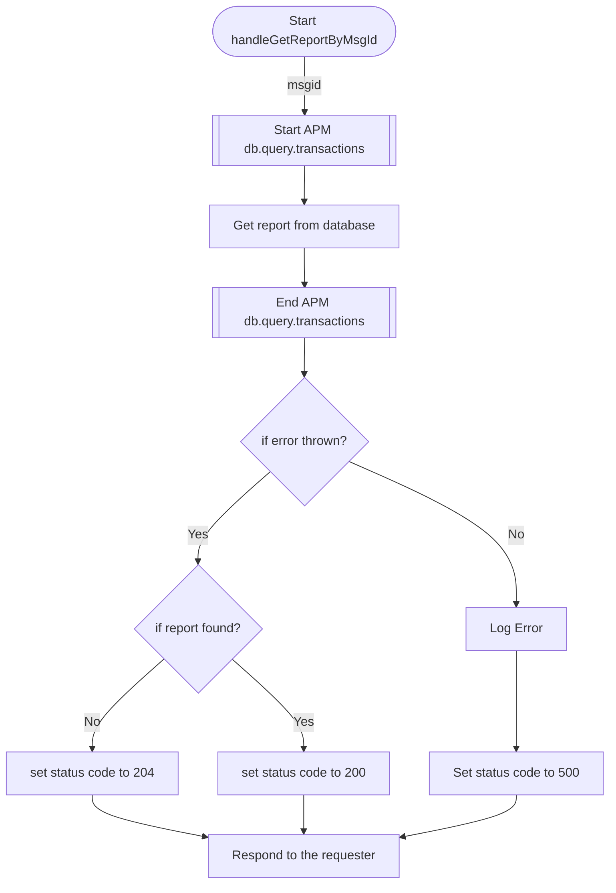

```mermaid
  flowchart TD
  A([Start handleGetReportByMsgId]) -->|msgid| B[[Start APM db.query.transactions]]
  B --> C[Get report from database]
  C --> V[["End APM db.query.transactions"]]
  V --> D{if error thrown?}
  D -->|Yes| E{if report found?}
  E -->|Yes| G[set status code to 200]
  E -->|No| K[set status code to 204]
  D -->|No| F[Log Error]
  F --> Z[Set status code to 500]
  K --> L[Respond to the requester]
  G --> L[Respond to the requester]
  Z --> L[Respond to the requester]
```

