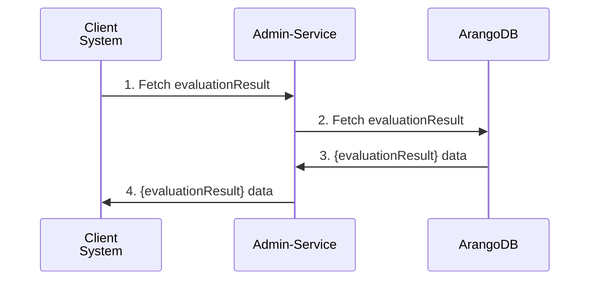

```mermaid
sequenceDiagram
    participant Client as Client<br>System
    participant ADMIN as Admin-Service    
    participant DB as ArangoDB

Client ->> ADMIN: 1. Fetch evaluationResult
ADMIN->> DB: 2. Fetch evaluationResult 
DB->> ADMIN: 3. {evaluationResult} data
ADMIN->> Client: 4. {evaluationResult} data
```
