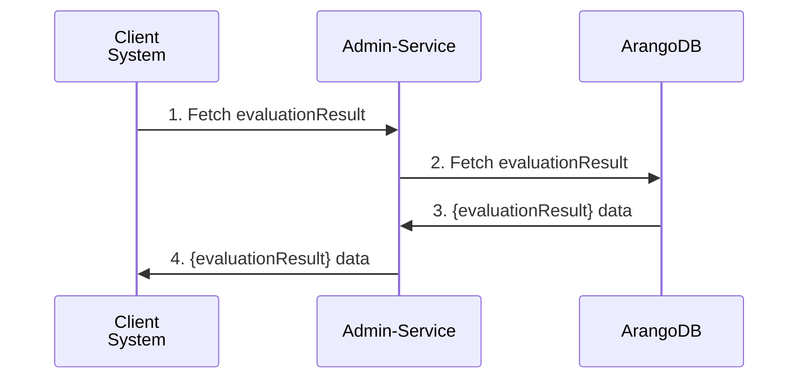
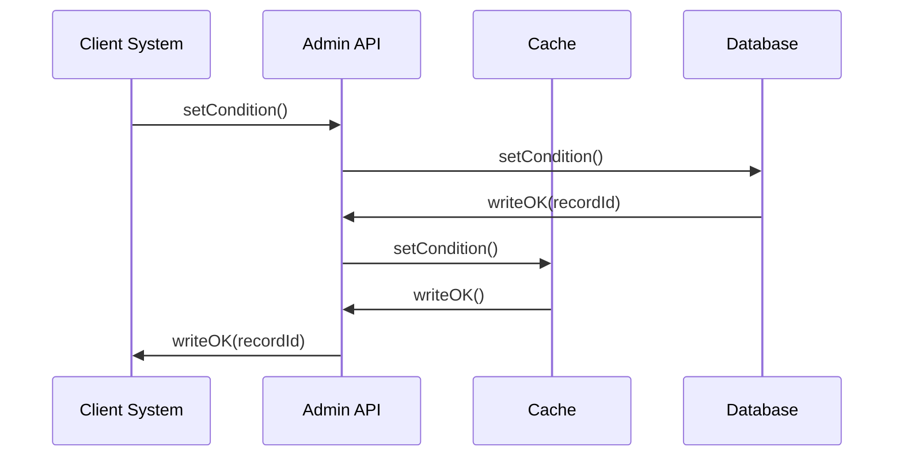

<!-- SPDX-License-Identifier: Apache-2.0 -->
# Admin Service Documentation

## Overview

The **Admin Service** is a Node.js-based API designed for administrative tasks, with a particular focus on report and condition management. It utilizes the Fastify framework to deliver a high-performance and low-overhead API interface. This document offers an in-depth examination of the API, covering setup requirements, a comprehensive overview of the application, and detailed route documentation.

## Pre-requisites

Before you start using the Admin API, ensure that you have the following items:

1. **Node.js**: Version 20.x or higher.
    - Download from [Node.js Official Website](https://nodejs.org/).
    - Verify installation using `node -v` and `npm -v`.

2. **NPM**: A package manager for Node.js packages.
    - NPM is installed with Node.js.

3. **Git**: Version control system for cloning the repository.
    - Download from [Git Official Website](https://git-scm.com/).

4. **Database**: Arango database setup.
    - Ensure the database is running and accessible from your Node.js environment.

5. **Environment Variables**: Set up environment variables required by the application, such as database connection strings. Typically stored in a `.env` file.

## Installation and Setup

1. **Clone the Repository**:
    ```bash
    git clone https://github.com/@frmscoe/admin-service.git
    cd admin-service
    ```

2. **Install Dependencies**:
    ```bash
    npm install
    ```

3. **Configure Environment Variables**:
    - Create a `.env` file in the root directory and add necessary configuration values

4. **Run the Server**:
    ```bash
    npm start
    ```

5. **Access the API**:
    - The server runs on `http://localhost:3000` by default. You can access the API via your browser or any HTTP client like Postman.

## API Endpoints

### 1. `/v1/admin/reports/getreportbymsgid`

#### Description
This endpoint retrieves a report by the specified message ID (`msgid`). The message ID is provided as a query parameter.

#### Flow Diagram


#### URL
```
/v1/admin/reports/getreportbymsgid
```

#### Method
```
GET
```

#### Query Parameters

| Parameter | Type   | Required | Description                     |
|-----------|--------|----------|---------------------------------|
| `msgid`   | String | Yes      | The message ID to get the report for. |

#### Headers
No specific headers required apart from standard authentication headers if needed.

### Request Example
```http
GET /v1/admin/reports/getreportbymsgid?msgid=1234567890 HTTP/1.1
```

#### Response

- **Status 400 Bad Request:** When `msgid` is missing or invalid.
    ```json
    {
      "statusCode": 400,
      "code": "FST_ERR_VALIDATION",
      "error": "Bad Request",
      "message": "querystring must have required property 'msgid'"
    }
    ```

- **Status 204 Not Found:** When no report is found for the given `msgid`.
    ```json
    {
      "statusCode": 204,
    }
    ```

- **Status 500 Internal Server Error:** For server-side errors.
    ```json
    {
      "status": "error",
      "message": "Internal server error occurred."
    }
    ```


### 2. 
##### a. `/v1/admin/event-flow-control/entity`
##### b. `/v1/admin/event-flow-control/account`

#### Description

Both endpoints are responsible for storing conditions related to their specific accounts or entities. They are expected to store condition edges within the in-memory system and have different methods assigned to each endpoint: GET, POST, and PUT.

GET endpoints are used to retrieve data already stored by a POST request. You can use the SyncCache parameter to either sync active conditions or not. PUT endpoints are responsible for updating the expiry date of a specified condition.

#### Flow Diagram


#### URL 1
```
/v1/admin/event-flow-control/entity
```
#### Methods FOR URL 1
```
POST, GET, PUT
```

#### URL 2
```
/v1/admin/event-flow-control/account
```
#### Methods FOR URL 2
```
POST, GET, PUT
```

**Some endpoints share properties except for ntty and acct. These properties are specific to each endpoint and indicate the governing condition**
#### Body 
#### URL 1, 2 POST METHOD
| Parameter | Type   | Required | Description                     |
|-----------|--------|----------|---------------------------------|
| `evtTp`   | Array | Yes      | Event types |
| `condTp`   | String | Yes      | Condition type. |
| `prsptv`   | String | Yes      | Perspective of the condition. |
| `incptnDtTm`   | String | Yes      | Inception date. |
| `xprtnDtTm`   | String | Yes      | Expiration date. |
| `condRsn`   | String | Yes      | Reason code. |
| `forceCret`   | Boolean | Yes      | Flag indicating whether the entity should be created if it does not exist. |
| `usr`   | String | Yes      | User that triggered the operation. |
#### URL 1 POST METHOD
| Parameter | Type   | Required | Description                     |
|-----------|--------|----------|---------------------------------|
| `ntty`   | Object | Yes      | The entity object that the condition is governed by. |
#### URL 2 POST METHOD
| Parameter | Type   | Required | Description                     |
|-----------|--------|----------|---------------------------------|
| `acct`   | Object | Yes      | The account object that the condition is governed by. |
#### URL 1 GET METHOD
| Parameter | Type   | Required | Description                     |
|-----------|--------|----------|---------------------------------|
| `id`   | String | Yes      | Entity identifier |
| `schmeNm`   | String | Yes      |  Scheme name of the entity |
| `syncCache`   | String | No      | Accepts `all`, `active`, `default` or `no`  |
#### URL 2 GET METHOD
| Parameter | Type   | Required | Description                     |
|-----------|--------|----------|---------------------------------|
| `id`   | String | Yes      | Entity ID. |
| `schmeNm`   | String | Yes      | Scheme name of the account |
| `agt`   | String | Yes      | proprietary agent identifier |
| `syncCache`   | String | No      | Accepts `all`, `active`, `default` or `no`  |
#### URL 1 PUT METHOD
| Parameter | Type   | Required | Description                     |
|-----------|--------|----------|---------------------------------|
| `id`   | String | Yes      | Entity identifier |
| `schmeNm`   | String | Yes      |  Scheme name of the entity |
| `condId`   | String | Yes      | Condition identifier  |
#### Body data
| Body | Type   | Required | Description                     |
|-----------|--------|----------|---------------------------------|
| `xprtnDtTm`   | String | No      | New timedate of the condition |
#### URL 2 PUT METHOD
| Parameter | Type   | Required | Description                     |
|-----------|--------|----------|---------------------------------|
| `id`   | String | Yes      | Entity ID. |
| `schmeNm`   | String | Yes      | Scheme name of the account |
| `agt`   | String | Yes      | proprietary agent identifier |
| `condId`   | String | Yes      | Condition identifier  |
#### Body data
| Body | Type   | Required | Description                     |
|-----------|--------|----------|---------------------------------|
| `xprtnDtTm`   | String | No      | New timedate of the condition |

> [!IMPORTANT]  
> Ensure your query parameters are encoded as some properties can contain special characters. An `id` of `+12344567890` would need to be encoded as `+` is a special character.

Possible values for some fields mention in the table above
1. **evtTp**  : [`'pacs.008.001.10'`,`'pacs.002.001.12'`,`'pain.001.001.11'`,`'pain.013.001.09'` or `'all'`]
2. **condTp** : `non-overridable-block` or `override` or `overridable-block`
3. **prsptv** : `both` or `creditor` or `debtor`

**ntty object for :** `URL 1`
```JSON
{
  "id": "string",
  "schmeNm": {
    "prtry": "string"
  }
}
```

**acct object for :** `URL 2`
```JSON
{
  "id": "string",
  "schmeNm": {
      "prtry": "string"
  },
  "agt": {
    "finInstnId": {
      "clrSysMmbId": {
        "mmbId": "string"
      }
    }
  }
}
```

#### Headers
No specific headers required for both endpoints.


```http
POST /v1/admin/event-flow-control/entity HTTP/1.1
```

#### Response

- **Status 400 Bad Request:** When `prsptv` is missing or invalid.
    ```json
    {
      "statusCode": 400,
      "code": "FST_ERR_VALIDATION",
      "error": "Bad Request",
      "message": "body must have required property 'prsptv'"
    }
    ```

- **Status 500 Not Found:** When account was not found in the database and forceCret was set to false
    ```json
    {
      "statusCode": 500,
      "message": "Error: account was not found and we could not create one because forceCret is set to false"
    }
    ```

- **Status 500 Internal Server Error:** For server-side errors.
    ```json
    {
      "status": "error",
      "message": "Internal server error occurred."
    }
    ```

```http
POST /v1/admin/event-flow-control/account HTTP/1.1
```

#### Response

- **Status 400 Bad Request:** When `condTp` is missing or invalid.
    ```json
    {
      "statusCode": 400,
      "code": "FST_ERR_VALIDATION",
      "error": "Bad Request",
      "message": "body must have required property 'condTp'"
    }
    ```

- **Status 500 Not Found:** When expiration date is before inception date.
    ```json
    {
      "statusCode": 500,
      "message": "Error: Expiration date must be after inception date."
    }
    ```

- **Status 500 Internal Server Error:** For server-side errors.
    ```json
    {
      "status": "error",
      "message": "Internal server error occurred."
    }
    ```

