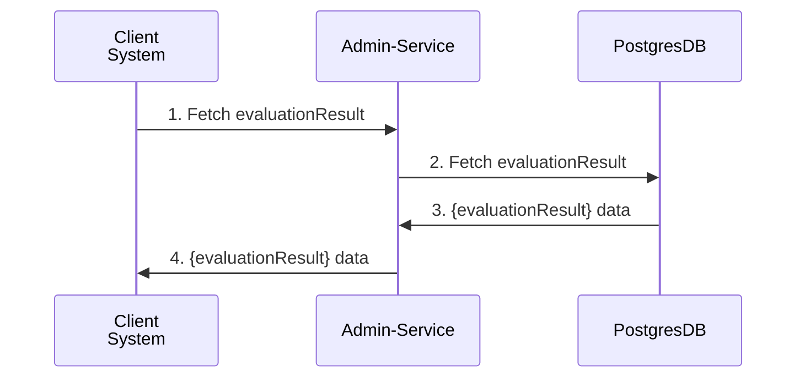
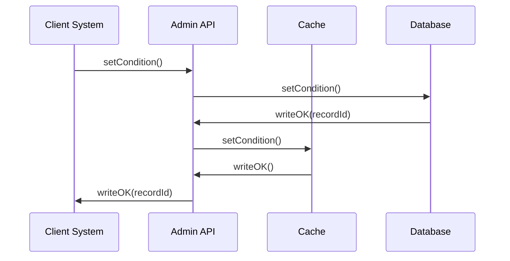
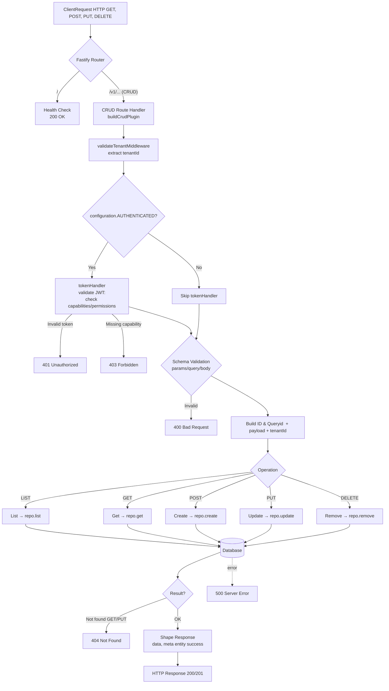

<!-- SPDX-License-Identifier: Apache-2.0 -->
# Admin Service Documentation

## Overview

The **Admin Service** is a Node.js-based API designed for administrative tasks, with a particular focus on report and condition management. It utilizes the Fastify framework to deliver a high-performance and low-overhead API interface. This document offers an in-depth examination of the API, covering setup requirements, a comprehensive overview of the application, and detailed route documentation.

## Timestamp Fields

All entities managed by the Admin Service now include automated timestamp tracking:

### creDtTm (Creation DateTime)
Indicates when a record was initially created in the system.
- **Type**: ISO 8601 timestamp string
- **Format**: `YYYY-MM-DDTHH:mm:ss.sssZ` (UTC timezone)
- **Behavior**: Automatically set during record creation, immutable thereafter
- **Example**: `"2023-02-03T07:17:52.216Z"`

### updDtTm (Update DateTime) 
Indicates when a record was last modified.
- **Type**: ISO 8601 timestamp string 
- **Format**: `YYYY-MM-DDTHH:mm:ss.sssZ` (UTC timezone)
- **Behavior**: Automatically updated on every record modification
- **Example**: `"2023-02-04T10:30:15.789Z"`

### Timestamp Behavior
- All timestamps are stored and returned in UTC timezone
- Timestamps are automatically managed by the system and cannot be manually set via API
- Both fields are included in all GET, POST, and PUT operation responses
- Timestamps follow ISO 8601 standard for consistent parsing across systems

### forceCret Behavior with Timestamps
When `forceCret` is set to `true` during entity or account creation:
- The system will create new records if they don't exist
- `creDtTm` is automatically set to the current system timestamp using `new Date().toISOString()`
- New records include both `creDtTm` and initial `updDtTm` values
- All timestamp fields are validated to ensure they are defined and of string type

## Pre-requisites

Before you start using the Admin API, ensure that you have the following items:

1. **Node.js**: Version 20.x or higher.
    - Download from [Node.js Official Website](https://nodejs.org/).
    - Verify installation using `node -v` and `npm -v`.

2. **NPM**: A package manager for Node.js packages.
    - NPM is installed with Node.js.

3. **Git**: Version control system for cloning the repository.
    - Download from [Git Official Website](https://git-scm.com/).

4. **Database**: Postgres database setup.
    - Ensure the database is running and accessible from your Node.js environment.

5. **Environment Variables**: Set up environment variables required by the application, such as database connection strings. Typically stored in a `.env` file.

## Installation and Setup

1. **Clone the Repository**:
    ```bash
    git clone https://github.com/@frmscoe/admin-service.git
    cd admin-service
    ```

2. **Install Dependencies**:
    ```bash
    npm install
    ```

3. **Configure Environment Variables**:
    - Create a `.env` file in the root directory and add necessary configuration values

4. **Run the Server**:
    ```bash
    npm run start
    ```

5. **Access the API**:
    - The server runs on `http://localhost:3000` by default. You can access the API via your browser or any HTTP client like Postman.

## API Endpoints

### 1. Get report by message id 

#### Description
This endpoint retrieves a report by the specified message ID (`msgid`). The message ID is provided as a query parameter.

#### Flow Diagram

```mermaid
sequenceDiagram
    participant Client as Client<br>System
    participant ADMIN as Admin-Service    
    participant DB as PostgresDB

Client ->> ADMIN: 1. Fetch evaluationResult
ADMIN->> DB: 2. Fetch evaluationResult 
DB->> ADMIN: 3. {evaluationResult} data
ADMIN->> Client: 4. {evaluationResult} data
```

#### URL
```
/v1/admin/reports/getreportbymsgid
```

#### Method
```
GET
```

#### Query Parameters

| Parameter | Type   | Required | Description                     |
|-----------|--------|----------|---------------------------------|
| `msgid`   | String | Yes      | The message ID to get the report for. |

#### Headers
No specific headers required apart from standard authentication headers if needed.

### Request Example
```http
GET /v1/admin/reports/getreportbymsgid?msgid=1234567890 HTTP/1.1
```

#### Response

- **Status 400 Bad Request:** When `msgid` is missing or invalid.
    ```json
    {
      "statusCode": 400,
      "code": "FST_ERR_VALIDATION",
      "error": "Bad Request",
      "message": "querystring must have required property 'msgid'"
    }
    ```

    **Status 200 OK:** Successful response with report data.
    ```json
    {
      "reportData": {
        "msgId": "1234567890",
        "evaluationResult": {
          "status": "completed",
          "score": 85.5,
          "riskLevel": "medium"
        },
        "creDtTm": "2023-02-03T07:17:52.216Z",
        "updDtTm": "2023-02-03T09:30:45.123Z"
      }
    }
    ```

- **Status 204 Not Found:** When no report is found for the given `msgid`.
    ```json
    {
      "statusCode": 204,
    }
    ```

- **Status 500 Internal Server Error:** For server-side errors.
    ```json
    {
      "status": "error",
      "message": "Internal server error occurred."
    }
    ```


### 2. Condition Management
##### a. `/v1/admin/event-flow-control/entity`
##### b. `/v1/admin/event-flow-control/account`

#### Description

Both endpoints are responsible for storing conditions related to their specific accounts or entities. They are expected to store condition edges within the in-memory system and have different methods assigned to each endpoint: GET, POST, and PUT.

GET endpoints are used to retrieve data already stored by a POST request. You can use the SyncCache parameter to either sync active conditions or not. PUT endpoints are responsible for updating the expiry date of a specified condition.

#### Flow Diagram

```mermaid
sequenceDiagram
  participant clientsystem as Client System
  participant tmsapi as Admin API
  participant cache as Cache
  participant db as Database

  clientsystem->>tmsapi: setCondition()
  tmsapi->>db: setCondition()
  db->>tmsapi: writeOK(recordId)
  tmsapi->>cache: setCondition()
  cache->>tmsapi: writeOK()
  tmsapi->>clientsystem: writeOK(recordId)
```

#### URL 1
```
/v1/admin/event-flow-control/entity
```
#### Methods FOR URL 1
```
POST, GET, PUT
```

#### URL 2
```
/v1/admin/event-flow-control/account
```
#### Methods FOR URL 2
```
POST, GET, PUT
```

**Some endpoints share properties except for ntty and acct. These properties are specific to each endpoint and indicate the governing condition**
#### Body 
#### URL 1, 2 POST METHOD
| Parameter | Type   | Required | Description                     |
|-----------|--------|----------|---------------------------------|
| `evtTp`   | Array | Yes      | Event types |
| `condTp`   | String | Yes      | Condition type. |
| `prsptv`   | String | Yes      | Perspective of the condition. |
| `incptnDtTm`   | String | Yes      | Inception date. |
| `xprtnDtTm`   | String | Yes      | Expiration date. |
| `condRsn`   | String | Yes      | Reason code. |
| `forceCret`   | Boolean | Yes      | Flag indicating whether the entity should be created if it does not exist. |
| `usr`   | String | Yes      | User that triggered the operation. |
#### URL 1 POST METHOD
| Parameter | Type   | Required | Description                     |
|-----------|--------|----------|---------------------------------|
| `ntty`   | Object | Yes      | The entity object that the condition is governed by. |
#### URL 2 POST METHOD
| Parameter | Type   | Required | Description                     |
|-----------|--------|----------|---------------------------------|
| `acct`   | Object | Yes      | The account object that the condition is governed by. |
#### URL 1 GET METHOD
| Parameter | Type   | Required | Description                     |
|-----------|--------|----------|---------------------------------|
| `id`   | String | Yes      | Entity identifier |
| `schmenm`   | String | Yes      |  Scheme name of the entity |
| `synccache`   | String | No      | Accepts `all`, `active`, `default` or `no`  |
| `activeonly`   | String | No      | Accepts `yes`, or `no`  |
#### URL 2 GET METHOD
| Parameter | Type   | Required | Description                     |
|-----------|--------|----------|---------------------------------|
| `id`   | String | Yes      | Entity ID. |
| `schmenm`   | String | Yes      | Scheme name of the account |
| `agt`   | String | Yes      | proprietary agent identifier |
| `synccache`   | String | No      | Accepts `all`, `active`, `default` or `no`  |
| `activeonly`   | String | No      | Accepts `yes` or `no`  |
#### URL 1 PUT METHOD
| Parameter | Type   | Required | Description                     |
|-----------|--------|----------|---------------------------------|
| `id`   | String | Yes      | Entity identifier |
| `schmenm`   | String | Yes      |  Scheme name of the entity |
| `condId`   | String | Yes      | Condition identifier  |
#### Body data
| Body | Type   | Required | Description                     |
|-----------|--------|----------|---------------------------------|
| `xprtnDtTm`   | String | No      | New timedate of the condition |
#### URL 2 PUT METHOD
| Parameter | Type   | Required | Description                     |
|-----------|--------|----------|---------------------------------|
| `id`   | String | Yes      | Entity ID. |
| `schmenm`   | String | Yes      | Scheme name of the account |
| `agt`   | String | Yes      | proprietary agent identifier |
| `condId`   | String | Yes      | Condition identifier  |
#### Body data
| Body | Type   | Required | Description                     |
|-----------|--------|----------|---------------------------------|
| `xprtnDtTm`   | String | No      | New timedate of the condition |

> [!IMPORTANT]  
> Ensure your query parameters are encoded as some properties can contain special characters. An `id` of `+12344567890` would need to be encoded as `+` is a special character.

Possible values for some fields mention in the table above
1. **evtTp**  : [`'pacs.008.001.10'`,`'pacs.002.001.12'`,`'pain.001.001.11'`,`'pain.013.001.09'` or `'all'`]
2. **condTp** : `non-overridable-block` or `override` or `overridable-block`
3. **prsptv** : `both` or `creditor` or `debtor`

**ntty object for :** `URL 1`
```JSON
{
  "id": "string",
  "schmeNm": {
    "prtry": "string"
  }
}
```

**acct object for :** `URL 2`
```JSON
{
  "id": "string",
  "schmeNm": {
      "prtry": "string"
  },
  "agt": {
    "finInstnId": {
      "clrSysMmbId": {
        "mmbId": "string"
      }
    }
  }
}
```

#### Headers
No specific headers required for both endpoints.

### Request Examples

```http
GET /v1/admin/event-flow-control/entity?id=user123&schmenm=MSISDN&synccache=active HTTP/1.1
```

#### GET Response

- **Status 200 OK:** Successful condition retrieval.
    ```json
    {
      "conditions": [
        {
          "condId": "cond-67890-entity",
          "evtTp": ["pacs.008.001.10"],
          "condTp": "non-overridable-block",
          "prsptv": "debtor",
          "incptnDtTm": "2023-02-03T06:00:00.000Z",
          "xprtnDtTm": "2023-02-10T23:59:59.999Z",
          "condRsn": "SUSPICIOUS_ACTIVITY",
          "status": "active",
          "creDtTm": "2023-02-03T07:17:52.216Z",
          "updDtTm": "2023-02-03T07:17:52.216Z"
        }
      ]
    }
    ```

```http
GET /v1/admin/event-flow-control/account?id=acc456&schmenm=IBAN&agt=bank001&synccache=all HTTP/1.1
```

#### GET Response — Account

- **Status 200 OK:** Successful account condition retrieval.
    ```json
    {
      "conditions": [
        {
          "condId": "cond-54321-account",
          "evtTp": ["pacs.002.001.12", "pain.001.001.11"],
          "condTp": "overridable-block",
          "prsptv": "both",
          "incptnDtTm": "2023-02-02T08:00:00.000Z",
          "xprtnDtTm": "2023-02-09T18:00:00.000Z",
          "condRsn": "HIGH_RISK_TRANSACTION",
          "status": "active",
          "creDtTm": "2023-02-02T08:15:30.456Z",
          "updDtTm": "2023-02-03T09:20:45.789Z"
        }
      ]
    }
    ```


```http
POST /v1/admin/event-flow-control/entity HTTP/1.1
```

#### Response

- **Status 400 Bad Request:** When `prsptv` is missing or invalid.
    ```json
    {
      "statusCode": 400,
      "code": "FST_ERR_VALIDATION",
      "error": "Bad Request",
      "message": "body must have required property 'prsptv'"
    }
    ```

- **Status 500 Not Found:** When account was not found in the database and forceCret was set to false
    ```json
    {
      "statusCode": 500,
      "message": "Error: account was not found and we could not create one because forceCret is set to false"
    }
    ```

- **Status 500 Internal Server Error:** For server-side errors.
    ```json
    {
      "status": "error",
      "message": "Internal server error occurred."
    }
    ```

```http
POST /v1/admin/event-flow-control/account HTTP/1.1
```

#### Response

- **Status 400 Bad Request:** When `condTp` is missing or invalid.
    ```json
    {
      "statusCode": 400,
      "code": "FST_ERR_VALIDATION",
      "error": "Bad Request",
      "message": "body must have required property 'condTp'"
    }
    ```

- **Status 500 Not Found:** When expiration date is before inception date.
    ```json
    {
      "statusCode": 500,
      "message": "Error: Expiration date must be after inception date."
    }
    ```

     **Status 200 OK:** Successful condition creation.
    ```json
    {
      "id": "cond-12345-account",
      "status": "created",
      "accountId": "acct-987654",
      "conditionType": "non-overridable-block",
      "creDtTm": "2023-02-03T07:17:52.216Z",
      "updDtTm": "2023-02-03T07:17:52.216Z"
    }
    ```

- **Status 500 Internal Server Error:** For server-side errors.
    ```json
    {
      "status": "error",
      "message": "Internal server error occurred."
    }
    ```

    ```http
PUT /v1/admin/event-flow-control/entity?id=user123&schmenm=MSISDN&condId=cond-67890-entity HTTP/1.1
Content-Type: application/json
```

```json
{
  "xprtnDtTm": "2023-02-15T23:59:59.999Z"
}
```

#### PUT Response

- **Status 200 OK:** Successful condition update.
    ```json
    {
      "condId": "cond-67890-entity",
      "status": "updated",
      "newExpirationDate": "2023-02-15T23:59:59.999Z",
      "creDtTm": "2023-02-03T07:17:52.216Z",
      "updDtTm": "2023-02-05T14:22:18.345Z"
    }
    ```

```http
PUT /v1/admin/event-flow-control/account?id=acc456&schmenm=IBAN&agt=bank001&condId=cond-54321-account HTTP/1.1
Content-Type: application/json

{
  "xprtnDtTm": "2023-02-20T18:00:00.000Z"
}
```

#### PUT Response - Account

- **Status 200 OK:** Successful account condition update.
    ```json
    {
      "condId": "cond-54321-account",
      "status": "updated", 
      "newExpirationDate": "2023-02-20T18:00:00.000Z",
      "creDtTm": "2023-02-02T08:15:30.456Z",
      "updDtTm": "2023-02-05T16:45:12.678Z"
    }
    ```

    
### Refreshing cache

```http
PUT /v1/admin/event-flow-control/cache HTTP/1.1
```

#### Response

- **Status 204 No Content:** Cache has been updated

--------

#  Repository CRUD Design Pattern


## 1) Repository Overview

Repositories provide a clear abstraction between the data layer and the API layer. Each repository implements the standard CRUD interface, handling data persistence logic independently from HTTP routing or validation concerns.


---

## 2) Request → Auth → CRUD → Repository Flow


```mermaid
flowchart TD
  A[ClientRequest HTTP GET, POST, PUT, DELETE] --> B{Fastify Router}
  B -->|"/"| HC[Health Check
200 OK]
  B -->|"/v1/... (CRUD)"| C[CRUD Route Handler
buildCrudPlugin]

  C --> VTM[validateTenantMiddleware
extract tenantId]
  VTM --> D{configuration.AUTHENTICATED?}

  D -->|Yes| TK[tokenHandler
validate JWT:
check capabilities/permissions]
  D -->|No| E[Skip tokenHandler]

  TK -->|Invalid token| U401[401 Unauthorized]
  TK -->|Missing capability| U403[403 Forbidden]
  TK --> QS

  E --> QS{Schema Validation
params/query/body}
  QS -->|Invalid| U400[400 Bad Request]
  QS --> P[Build ID & Queryid  + payload + tenantId]

  P --> R{Operation}
  R -->|LIST| RL[List → repo.list]
  R -->|GET| RG[Get → repo.get]
  R -->|POST| RC[Create → repo.create]
  R -->|PUT| RU[Update → repo.update]
  R -->|DELETE| RD[Remove → repo.remove]

  RL --> DB[(Database)]
  RG --> DB
  RC --> DB
  RU --> DB
  RD --> DB

  DB --> X{Result?}
  X -->|Not found GET/PUT| U404[404 Not Found]
  X -->|OK| S[Shape Response
data, meta  entity  success]
  S --> Z[HTTP Response 200/201]
  DB -.error.-> U500[500 Server Error]
```

## 3) Responsibilities of the Repository

Each repository implementation follows a standardized interface, ensuring consistent behavior across different entity types. The key responsibilities include:

* **Data Retrieval:** Executing parameterized SQL queries to list and fetch records from a table.
* **Entity Creation:** Inserting new configuration entries into the target table.
* **Entity Updating:** Replacing existing configuration data for a specific tenant and configuration key.
* **Entity Deletion:** Removing entries that match provided identifiers.
* **Filtering and Sorting:** Supporting dynamic filters and ordering for list operations.

**We have 3 different repositories :**

| No. | Config  | File name | Endpoint | Methods | 
| --- | --- | --------- | -------- | ----------- | 
| 1. | Network Map | network.map.repository | `/v1/admin/configuration/network_map` |  GET,POST,PUT,DEL, plus `POST {cfg}/activate` and `POST {cfg}/deactivate` |
| 2. | Rule Configuration |  rule.config.repository | `/v1/admin/configuration/rule` |  GET,POST (single or batch),PUT,DEL |
| 3. | Typology Configuration | typology.config.repository | `/v1/admin/configuration/typology` | GET,POST (single or batch),PUT,DEL |

### Configuration LIST query contract

The three configuration LIST endpoints (`network_map`, `rule`, `typology`) share a common query
contract, implemented by a single parameterised helper. A bare `GET` is **safe by default**: it
returns the first page only, not the whole table.

#### Query parameters

| Parameter | Type | Default | Description |
|-----------|------|---------|-------------|
| `limit` | integer `1-100`, or `all` | `20` | Page size. Use `all` to return the full tenant-scoped set in one response. `all` is mutually exclusive with a non-zero `offset` (returns `400`). Values above `100` return `400`. |
| `offset` | integer `>= 0` | `0` | Rows to skip for pagination. Cannot be combined with `limit=all`. |
| `sort` | per-entity allowlist | `id` (rule/typology), `cfg` (network_map) | Lead ordering column. The remaining unique-key column is always appended so paging is deterministic. A value outside the allowlist returns `400`. |
| `order` | `ASC` or `DESC` | `ASC` | Sort direction. |
| `filters[<field>]` | string | - | Exact-match filters. **All** supplied filters are ANDed (not just the first). Each `<field>` is allowlisted per entity; unknown keys are ignored. |
| `keys` | array of `{ id, cfg }` | - | Targeted batch fetch (rule/typology only): return exactly the listed composite `(id, cfg)` pairs in one query. Maximum 200 pairs (`400` past the cap). Supplied as `keys[0][id]=..&keys[0][cfg]=..`. |

Per-entity allowlists: `rule`/`typology` accept `sort`/`filters` of `id` and `cfg`; `network_map`
accepts `cfg` and `active` (`true`/`false`).

#### Response shape

```json
{
  "data": [ /* entity objects */ ],
  "meta": { "total": 128, "limit": 20, "offset": 0 }
}
```

`meta.total` is the real `COUNT(*)` of all matching rows (not the size of the returned page), so a
client can compute the number of pages. On the `limit=all` path, `meta.limit` equals `total` and
`meta.offset` is `0`.

#### Examples

```http
GET /v1/admin/configuration/network_map?filters[active]=true HTTP/1.1
GET /v1/admin/configuration/rule?limit=50&offset=50&sort=id&order=DESC HTTP/1.1
GET /v1/admin/configuration/typology?limit=all HTTP/1.1
GET /v1/admin/configuration/rule?keys[0][id]=EFRuP@1.0.0&keys[0][cfg]=1.0.0&keys[1][id]=R1&keys[1][cfg]=1.0.0&limit=all HTTP/1.1
```

### Configuration POST contract (single or batch)

The `rule` and `typology` POST endpoints accept **either** a single configuration object **or** an
array of configuration objects in one request. `network_map` is intentionally excluded (its
single-active-per-tenant invariant and `activate`/`deactivate` swap make atomic bulk insert
semantics ambiguous), so its POST accepts a single object only.

#### Accepted body shapes

A single object (unchanged, backwards compatible):

```json
{ "id": "EFRuP@1.0.0", "cfg": "1.0.0", "config": { /* ... */ } }
```

An array of objects (batch). A common shape is one entity identity (`id` is slow-changing) submitted
with several config versions (`cfg` is the high-churn part of the key) in a single atomic insert:

```json
[
  { "id": "EFRuP@1.0.0", "cfg": "1.0.0", "config": { /* ... */ } },
  { "id": "EFRuP@1.0.0", "cfg": "1.0.1", "config": { /* ... */ } }
]
```

Each array element must follow the same Create schema as the single-object body. Unknown
top-level fields are stripped before insert on both paths (no mass-assignment via the array form).

#### Semantics

| Aspect | Behaviour |
|--------|-----------|
| Array bounds | `minItems` 1, `maxItems` 200 by default. An empty array or one over the cap returns `400`. |
| Validation | Every item is validated **before** any insert. The first invalid item returns `400` with a body message of the form `item[<index>]: <path> <reason>`, identifying which element failed. |
| Atomicity | All items in a batch are inserted inside a single configuration-pool transaction. If any insert fails the whole batch is rolled back - it is all-or-nothing, never a partial write. |
| Tenant scoping | Every item is stamped with the `tenantId` from the auth token, exactly as the single-object path. |
| Success status | `201 Created` for both the single-object and the array form. |

#### Response body note

For the **single-object** path the `201` response body is the created entity, serialized against the
entity schema - unchanged, and the same on batch-enabled routes as on single-only routes.

For the **array** path the success body (the array of created entities) is serialized **element by
element** with that same entity serializer, then joined into a JSON array - so every element is shaped
identically to a single-object create (declared keys in schema order, schema-bound formatting). The
route cannot hand the whole array to one schema serializer because a `Type.Union` of the single entity
and an array of items cannot be compiled by `fast-json-stringify` when the entity schema is recursive
(typology's `expression`); reusing the per-element entity serializer keeps the array reply consistent
with the single-object reply without compiling a recursive union. One consequence remains in the
generated OpenAPI: the array request items are typed as a generic object (`{}`); the per-item shape is
the entity Create schema documented above.

#### Examples

A single rule (the single-object form):

```http
POST /v1/admin/configuration/rule HTTP/1.1
Content-Type: application/json

{ "id": "EFRuP@1.0.0", "cfg": "1.0.0", "config": { } }
```

A batch of rule config versions - one `id`, several `cfg` values, inserted atomically:

```http
POST /v1/admin/configuration/rule HTTP/1.1
Content-Type: application/json

[
  { "id": "EFRuP@1.0.0", "cfg": "1.0.0", "config": { } },
  { "id": "EFRuP@1.0.0", "cfg": "1.0.1", "config": { } }
]
```

A batch of typology config versions (note typology's required `rules`, `expression`, `workflow`
fields - there is no `config` field on a typology):

```http
POST /v1/admin/configuration/typology HTTP/1.1
Content-Type: application/json

[
  { "id": "typology-processor@1.0.0", "cfg": "1.0.0", "rules": [], "expression": [], "workflow": { "alertThreshold": 100 } },
  { "id": "typology-processor@1.0.0", "cfg": "1.0.1", "rules": [], "expression": [], "workflow": { "alertThreshold": 100 } }
]
```


---

## 4) Conceptual Flow of Operations

### List Operation

When listing entities, the repository constructs a SQL statement dynamically using optional filters and sort parameters. Tenant ID is always included to ensure the query operates within the tenant’s data domain. Every supplied filter is applied (ANDed), and ordering is deterministic: the chosen `sort` column followed by the remaining unique-key columns.

The result is normalized into a consistent `{ data, total }` format expected by the CRUD plugin, where `total` is a separate `COUNT(*)` of all matching rows (not the size of the returned page). The CRUD plugin then shapes the HTTP response as `{ data, meta }`.

### Get Operation

The `get` method retrieves a single entity record based on its unique key and `tenantId` — `(id, cfg)` for rule and typology, and `(cfg)` for network_map. If the record exists, it returns the parsed configuration object; otherwise the endpoint responds `404`.

### Create Operation

The creation method inserts a new configuration entry into the database. The payload is augmented with the tenant identifier from auth token before being stored. The inserted configuration is returned as confirmation. The `create` method also accepts an optional transaction `client`; when supplied (by the batch POST path) the insert runs on that pinned client so a multi-item batch commits or rolls back atomically. See **Configuration POST contract (single or batch)** above for the `rule`/`typology` array form.

### Update Operation

The update process replaces an existing configuration record that matches `cfg` and `tenantId`. The repository ensures atomic updates by returning the modified record upon success or `null` if the record does not exist.

### Delete Operation

The deletion process removes the record from the table matching its unique key and `tenantId`. When a row is deleted it returns `200` with `{ "success": true }`. When no matching row exists it returns `404` (parity with GET and PUT), rather than `200 { "success": false }`.

### Activate / Deactivate Operation (network_map only)

Network maps carry a single-active-per-tenant invariant, enforced at the database level by the partial unique index `idx_networkmap_active_tenant on network_map (tenantId) where active = true`. Two dedicated actions switch which map is active without a full `PUT` replace:

```http
POST /v1/admin/configuration/network_map/{cfg}/activate HTTP/1.1
POST /v1/admin/configuration/network_map/{cfg}/deactivate HTTP/1.1
```

**Activate** promotes the target map and demotes the currently-active map (if any) in a single atomic swap, returning the activated map. Because `active` (and `cfg`) are generated `STORED` columns derived from the `configuration` JSONB, the flag is flipped by rewriting the JSON with `jsonb_set` rather than a direct `UPDATE`. The partial unique index is non-deferrable and checked per row, so the swap runs inside one transaction and demotes the current map **before** promoting the target - at no instant are two rows active, regardless of physical row order (a single multi-row `UPDATE` would otherwise risk a `23505` unique-violation). The target's existence is checked first and outside the transaction: a missing map returns `404` with no writes (no rollback needed). `updDtTm` is bumped on both the demoted and promoted records.

**Deactivate** sets a single map inactive in one atomic statement (zero active maps is a legal state, so no transaction is required), bumps `updDtTm`, and returns the deactivated map, or `404` when the target does not exist.

> Network maps are loaded inactive and promoted when ready. Posting a map with `active = true` that would collide with an existing active map is rejected by the unique index (surfaced as a `500`); use `activate` to perform a safe swap instead.

#### Service-channel reload signalling and ack sink

After an `activate` commits, admin-service can broadcast a `network-map.activated` CloudEvent on the service channel so downstream consumers (for example event-director) reload the promoted map. The per-request `reloadMode` body field controls this (`broadcast` by default, `none` to suppress); dispatch is advisory and degrades without failing the activation (the DB commit is the source of truth), reported back under `reloadDispatched`.

Consumers reply with an ack on the reply subject (`SERVICE_CHANNEL_CONSUMER`, default `service-channel-ack`). admin-service runs a standing **fire-and-log ack sink** on that subject: each ack is logged as a single advisory line carrying the acking `source`, the `correlationId` (the activation event's id) and the `outcome`. A `success` ack logs at info; an `outcome: error` ack escalates to `error` so a failed downstream fulfilment of an activation admin-service dispatched is surfaced. The sink is advisory only - it never blocks or fails an activation, performs no aggregation or tally, and swallows a malformed ack (logged at `warn`) so a single bad message cannot tear down the subscription.

---

## 5) Error Handling and Query Safety

The repository leverages parameterized SQL queries to prevent injection vulnerabilities. The database interaction utility (`handlePostExecuteSqlStatement`) encapsulates execution, result parsing, and mapping logic. Each operation validates the query result and enforces type consistency.

Failures such as missing records or constraint violations are surfaced gracefully, allowing the CRUD layer to translate them into HTTP responses.

---

## 6) Integration with the CRUD Plugin

The repository is registered with the CRUD plugin builder using its entity schema and API prefix. Once registered, all HTTP routes automatically delegate database interactions to this repository. The plugin handles:

* Request validation
* Parameter parsing
* Tenant enforcement
* Response shaping

This ensures that the repository remains focused solely on persistence logic.

---

## 7) Best Practices for Repository Design

* **Enforce Tenant Boundaries:** Always include `tenantId` in filters and write conditions.
* **Use Parameterized Queries:** Prevent injection and maintain predictable execution plans.
* **Keep Repositories Pure:** Avoid embedding business logic or request-side context in repositories.
* **Normalize Outputs:** Ensure all methods return predictable structures (`{ data, total }`, `TEntity | null`, `boolean`).
* **Support Configurable Filtering:** Design flexible filters for future extensibility.

---

## 8) Claims & Tokens

This section describes how claims-based tokens are used for authentication and authorization across CRUD endpoints, what claims to include, and the trade‑offs of this approach.

### 7.1 Token Models

**Authorization claims**

* `permissions` (or `capabilities`): **Fine‑grained action strings** aligned to route capabilities (see 7.2). Example: `GET_V1_ADMIN_CONFIGURATION_RULE`.

**Tenancy & configuration claims**

* `tenantId`: The caller’s tenant context (MUST be bound to all data operations).
* `payload: cfg`: Configuration partition/variant required by repositories.

### 7.2 Mapping Claims to CRUD Endpoints

Use **capability-style permissions** that the API checks per request via the token handler. Capabilities are derived as:

```
<METHOD><PREFIX_WITH_SLASHES_AS_UNDERSCORES_UPPERCASE>
```
PREFIX example: `v1/admin/configuration/rule`

For the configuration entities shown earlier, recommended permission strings include:

* `LIST_V1_ADMIN_CONFIGURATION_NETWORK_MAP`

* `GET_V1_ADMIN_CONFIGURATION_NETWORK_MAP`

* `POST_V1_ADMIN_CONFIGURATION_NETWORK_MAP`

* `PUT_V1_ADMIN_CONFIGURATION_NETWORK_MAP`

* `DELETE_V1_ADMIN_CONFIGURATION_NETWORK_MAP`

* `LIST_V1_ADMIN_CONFIGURATION_RULE`

* `GET_V1_ADMIN_CONFIGURATION_RULE`

* `POST_V1_ADMIN_CONFIGURATION_RULE`

* `PUT_V1_ADMIN_CONFIGURATION_RULE`

* `DELETE_V1_ADMIN_CONFIGURATION_RULE`

* `LIST_V1_ADMIN_CONFIGURATION_TYPOLOGY`

* `GET_V1_ADMIN_CONFIGURATION_TYPOLOGY`

* `POST_V1_ADMIN_CONFIGURATION_TYPOLOGY`

* `PUT_V1_ADMIN_CONFIGURATION_TYPOLOGY`

* `DELETE_V1_ADMIN_CONFIGURATION_TYPOLOGY`

> The token handler should accept **any** of the above capabilities depending on the endpoint being accessed. A default‑deny policy is recommended when the claim is missing.


### 7.6 Best Practices

* **Bind to tenant & payload:cfg:** Enforce `tenantId` and `payload:cfg` presence and consistency on every request.
* **Version capabilities:** Namespace or version permission strings when APIs evolve (e.g., `GET_V1_...`).

---

**Notes**

* `tenantId` is established by middleware and injected into every repository call.
* `cfg` is provided as the path segment for generated configuration GET/PUT/DELETE routes and included in ID construction.
* Capability strings follow the `<METHOD><PREFIX_WITH_SLASHES_AS_UNDERSCORES>` pattern (e.g., `GET_V1_ADMIN_CONFIGURATION_RULE`).

---

## 8) Summary

The repository pattern isolates data persistence logic from application behavior. In the context of Fastify and the CRUD plugin system, it:

* Promotes maintainable and testable data logic.
* Provides a clean boundary for tenant-aware, configuration-driven operations.
* Supports consistent integration with RESTful endpoints.
